# Queries

## Query 1

A query to select all asteroids discovered after 1940

```sql
SELECT * FROM asteroids where 'Discovery Date' > '1940-01-01';
```

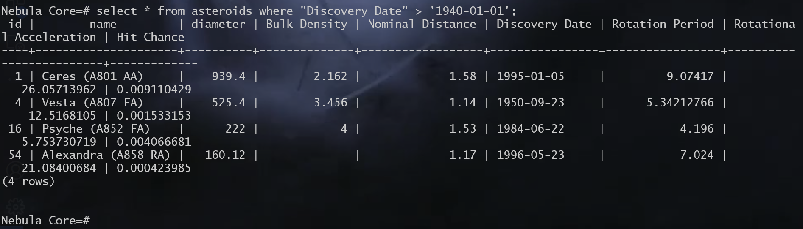

## Query 2

A query to select the top 5 exoplanets with the longest orbital period

```sql
SELECT name, orbital_period FROM exoplanets ORDER BY orbital_period LIMIT 5;
```

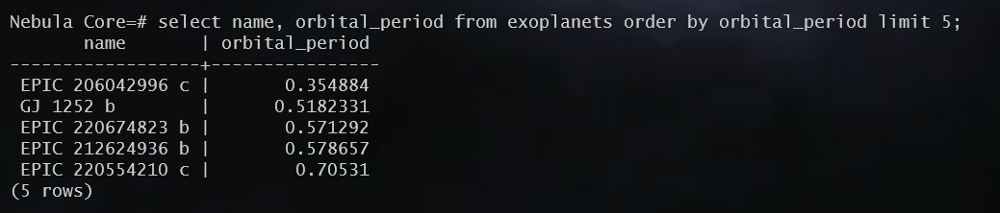

## Query 3

A query to find all launch sites operated by a country (and their count)

```sql
SELECT country, count(*) Count, STRING_AGG(name, ', ') 'Launch Sites' FROM launch_sites GROUP BY country;
```

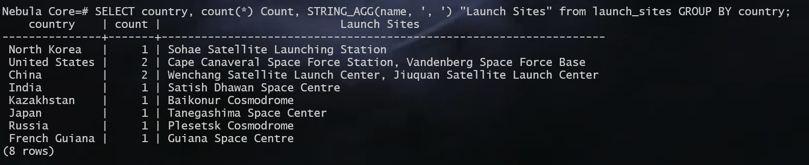

## Query 4

Query to find the five biggest stars in terms of their radius

```sql
SELECT * FROM stars WHERE 'Solar radius' IS NOT NULL ORDER BY 'Solar radius' DESC LIMIT 5;
```

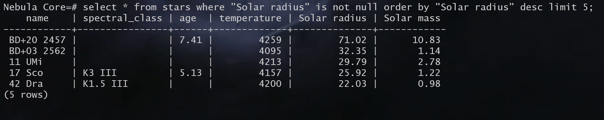

## Query 5

Find all telescopes operating in the infrared spectrum

```sql
SELECT * FROM telescopes WHERE spectrum='Infrared' OR spectrum LIKE '%IR%';
```

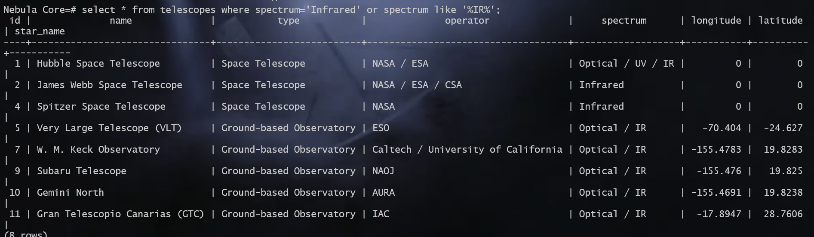

## Query 6

Find the spacecraft with the maximum capacity

```sql
SELECT * FROM spacecraft WHERE capacity = (SELECT MAX(capacity) FROM spacecraft);
```

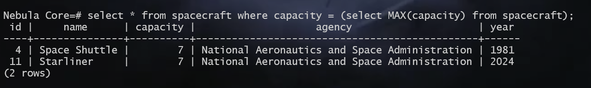

## Query 7

Find the country with the most number of spacecraft

```sql
SELECT name, COUNT(operator) FROM satellites GROUP BY operator ORDER BY COUNT(operator) DESC LIMIT 1;
```

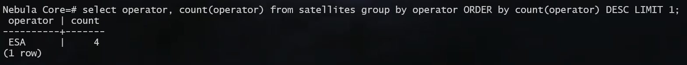

## Query 8

Find all asteroids who diameter is larger than the average of all asteroids discovered after 1880

```sql
SELECT * FROM asteroids WHERE diameter > (SELECT AVG(diameter) FROM asteroids WHERE 'Discovery Date' > '1880-01-01');
```

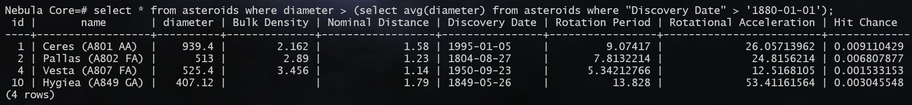

## Query 9

Get the telescope info which made it's respective observations

```sql
SELECT o.date, t.name "Telescope", t.spectrum "Spectrum", o.textual_info "Info" FROM telescopes t JOIN observations o ON t.id=o.telescope_id;
```

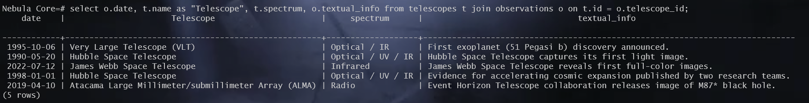

## Query 10

Get the star data which has more than average temperature as per it's spectral class (also displaying the average temperature)

```sql
SELECT s.*, avg_tmp FROM stars s JOIN (
    SELECT LEFT(spectral_class, 1)  class_letter, avg(temperature) avg_tmp FROM stars GROUP BY LEFT(spectral_class,1)
) AS avg_table ON LEFT(spectral_class, 1) = avg_table.class_letter  WHERE s.temperature > avg_table.avg_tmp ORDER BY avg_table.class_letter;
```

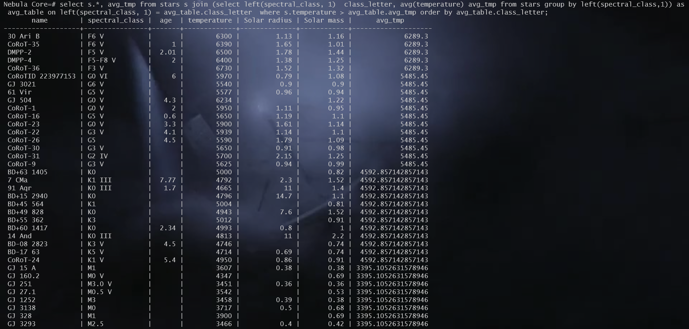

## Query 11

Find all (ground based) telescopes located between -100 and 100 longitude and -30 and 30 latitude

```sql
SELECT * FROM telescopes WHERE longitude BETWEEN -100 AND 100 AND latitude BETWEEN -30 AND 30 AND longitude <> 0 AND latitude <> 0;
```

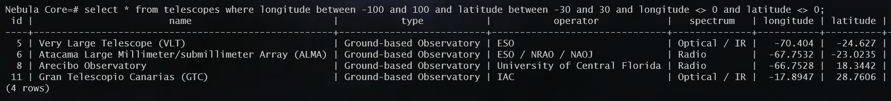

## Query 12

Find all asteroids who have been closer to earth than the average

```sql
SELECT * FROM asteroids WHERE "Nominal Distance" < (SELECT AVG("Nominal Distance") FROM asteroids) LIMIT 10;
```

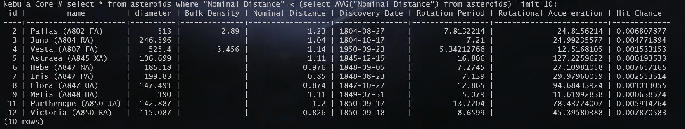

## Query 13

Find the year with highest total probability of an asteroid hit

```sql
SELECT
    EXTRACT(YEAR FROM "Discovery Date") AS discovery_year, SUM("Hit Chance") "Total hit chance"
FROM asteroids 
WHERE
    "Discovery Date" IS NOT NULL AND "Hit Chance" IS NOT NULL
GROUP BY
    discovery_year
ORDER BY
    "Total hit chance" DESC
LIMIT 1;
```

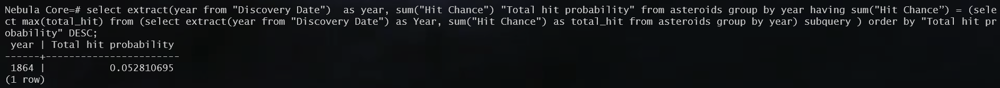

## Query 14

Find the number of exoplanets discovered by each instrument

```sql
SELECT 
  TRIM(SUBSTRING(discovery_method FROM POSITION('(' IN discovery_method) + 1 FOR POSITION(')' IN discovery_method) - POSITION('(' IN discovery_method) - 1)) AS instrument,
  COUNT(*) AS planet_count
FROM exoplanets
GROUP BY instrument;
```

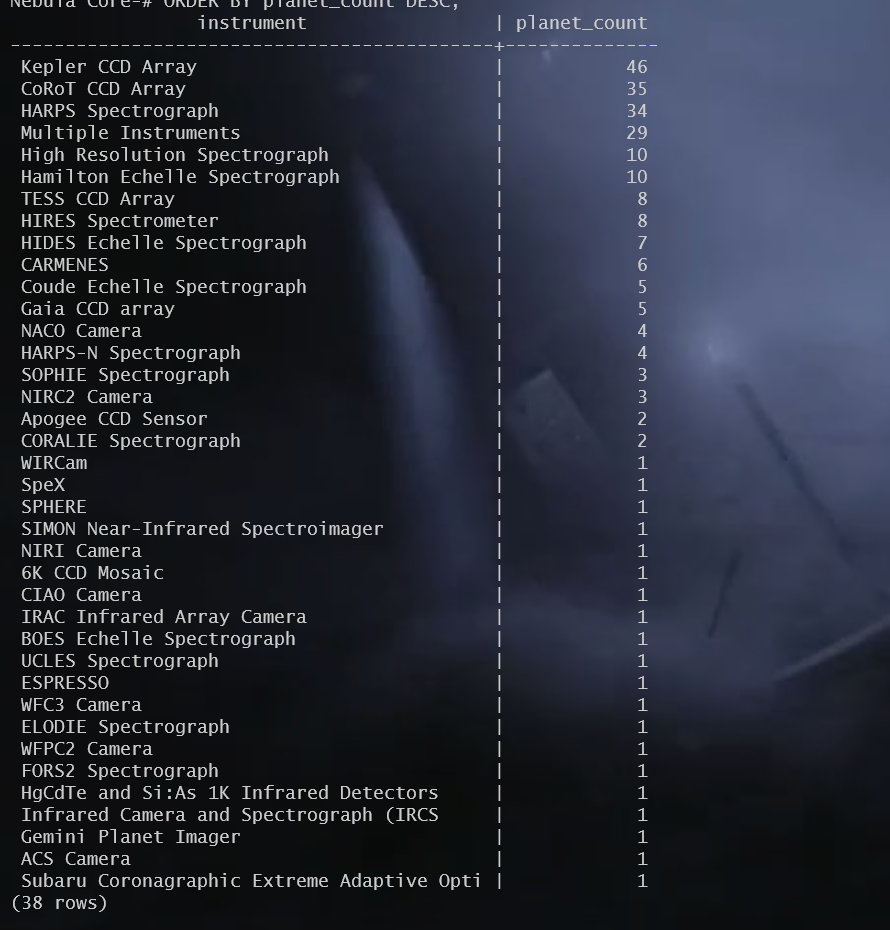
